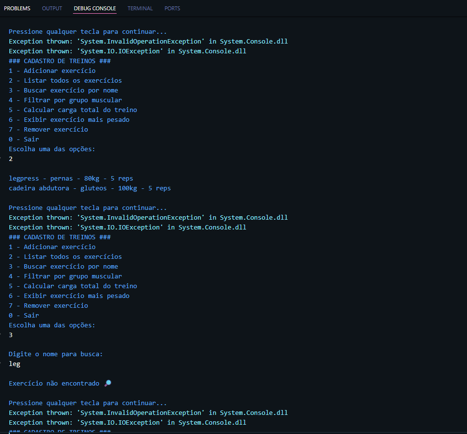

# POO II

 

## 🚀 Atividade Prática I
<b>CONTEXTO</b>  
Uma academia deseja um sistema simples para registrar e analisar os exercícios realizados pelos alunos durante um treino. Você foi contratado para desenvolver um programa em C# (console) que permita cadastrar, consultar e analisar esses 
exercícios.

## 🖥️ Código em Execução

