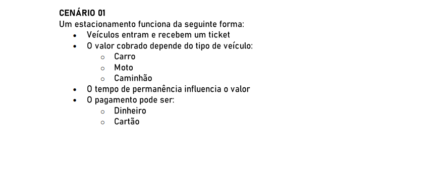

# POO II

### 🚩 Orientação de Desenvolvimento da Atividade

### 🚩 Cenário 01

## 💻 Desenvolvimento da Atividade

<h3>Classes</h3>

    1. VEÍCULO
    subclasses: Carro, Moto, Caminhao

    2. TICKETVAGA

    3. ESTACIONAMENTO

    4. PAGAMENTO
    subclasses: PagamentoDinheiro, PagamentoCartao

    5. TABELAPRECO

<h3>Métodos</h3>

        1. VEÍCULO
        getTipo() 
        getPlaca()

        2. TICKETVAGA
        gerar(veiculo, entrada)
        getEntrada()
        getSaida()
        setSaida()
        calcularTempo()

        3. ESTACIONAMENTO
        registrarEntrada(veiculo) -> TicketVaga
        registrarSaida(ticket) -> valor
        processarPagamento(ticket, Pagamento) -> comprovante
        consultarVagas(), listarTicketsAtivos()

        4. PAGAMENTO
        pagar(valor) -> comprovante
        validarDados()

        5. TABELA PREÇO
        calcularValor(veiculoTipo, tempo)

<h3>Interfaces</h3>

        IPagamento
        pagar(valor): Comprovante
        validar(): boolean

<h3>Relacionamentos</h3>

        Veiculo pode receber como herença Carro/Moto/Caminhao
        TicketVaga é associado ao Veículo
        Estacionamento usa TicketVaga e Pagamento
        Pagamento é implementado por PagamentoDinheiro e PagamentoCartão
        TicketVaga é associado a um Pagamento quando finalizado

<h2>Tratamento de Exceções</h2>

1. Estacionamento.registrarEntrada/registarSaida: validar disponibilidade e integridade do TicketVaga, aqui a idéia é lançar uma exceção tratada na camada de serviço (log + resposta ao usuário).  

2. TicketVaga.calcularTempo: validar timestamps para tratar erro de dados inválidos.

3. Pagamento.pagar: tratar falhas de autorização, rede, dados inválidos ao capturar e propagar mensagens.
