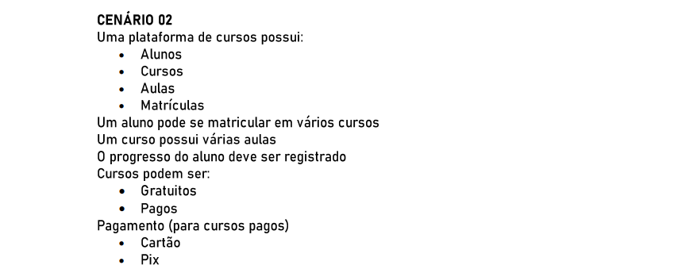

# POO II

### 🚩 Orientação de Desenvolvimento da Atividade

### 🚩 Cenário 02

## 💻 Desenvolvimento da Atividade

<h3>Classes</h3>

    1. ALUNO

    2. CURSO
    subclasses: CursoGratuito, CursoPago

    3. AULA

    4. MATRÍCULA

    5. STATUS

    6. PAGAMENTO
    subclasses: PagamentoCartao, PagamentoPix

    7. AMBIENTEAVA

<h3>Métodos</h3>

        1. ALUNO
        matricular(curso) -> Matricula
        consultarMatriculas()

        2. CURSO
        adicionarAula(aula)
        listarAulas()
        isPago(): boolean

        3. AULA
        getDuracao()
        getConteudo()

        4. MATRÍCULA
        registrarProgresso(aula, percentual)
        getStatus()

        5. STATUS
        atualizar(aula, status)

        6. PAGAMENTO
        pagar(valor)
        validar()

        7. AMBIENTEAVA
        criarCurso()
        buscarCurso()
        inscreverAluno(aluno, curso, ?pagamento)

<h3>Interfaces</h3>

        IPagamento
        pagar(valor): Comprovante

        ICurso
        listarAulas(), obterInfo(), isPago()

<h3>Relacionamentos</h3>

        Aluno 1..* Matricula onde um aluno pode ter várias matrículas
        Curso 1..* Aula onde um curso possui várias aulas
        Matricula associa Aluno ao Curso e contém seu status de percentual cursado
        CursoPago usa Pagamento
        AmbienteAva gerencia Cursos, Alunos e Matrículas

<h2>Tratamento de Exceções</h2>

1. Matrícula: verificar pré-requisitos como vagas e pagamento, e lançar exceções de negócio tratadas na camada do controller.

2. Pagamento: tratar falhas de autorização, estorno e comunicação com gateway, utilizar lógica de retry e compensação na camada de pagamento.

3. Registro de progresso: validar dados como se a aula pertence ao cursoe ao  aluno matriculado, onde checa e lança erros específicos.
