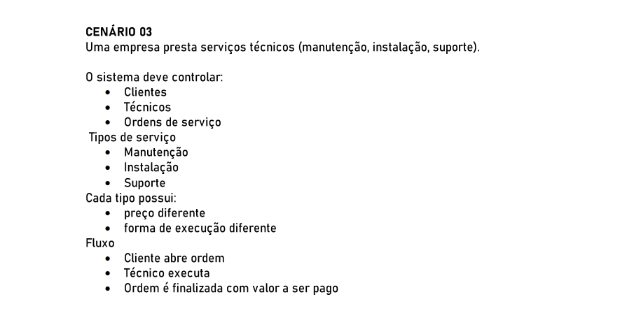

# POO II

### 🚩 Orientação de Desenvolvimento da Atividade

### 🚩 Cenário 03

## 💻 Desenvolvimento da Atividade

<h3>Classes</h3>

    1. CLIENTE

    2. TECNICO

    3. ORDEMSERVICO

    4. TIPOSERVICO: Manutencao, Instalacao, Suporte

    5. EXECUCAOSERVICO

    6. PAGAMENTO
    subclasses: PagamentoCartao, PagamentoPix

    7. HISTORICO

<h3>Métodos</h3>

    1. CLIENTE
    abrirOrdem(detalhes) -> OrdemServico

    2. TECNICO
    aceitarOrdem(os), executarOrdem(os, execucao)

    3. ORDEMSERVICO
    atribuirTecnico(tecnico)
    iniciar()
    finalizar(valorFinal)
    adicionarObservacao()
    calcularValor()

    4. TIPOSERVICO
    obterPrecoBase()
    obterProcedimento()

    5. EXECUCAOSERVICO
    registrarPasso()
    anexarEvidencia()

    6. PAGAMENTO
    pagar(valor)
    validar()

<h3>Interfaces</h3>

        IServico (interface para tipos de serviço)
        calcularPreco(parametros): decimal
        executarProcedimento(dados): ResultadoExecucao

        IOrdemServicoRepository (persistência)
        salvar(os)
        buscar(id)

<h3>Relacionamentos</h3>

        Cliente 1..* OrdemServico onde o cliente pode realizar a solicitação de ordem de serviços
        OrdemServico tem 1 Tecnico após a atribuição
        OrdemServico tem 1 TipoServico
        OrdemServico associa ExecucaoServico e Pagamento/Historico

<h2>Tratamento de Exceções</h2>

1. Matrícula: verificar pré-requisitos como vagas e pagamento, e lançar exceções de negócio tratadas na camada do controller.

2. Pagamento: tratar falhas de autorização, estorno e comunicação com gateway, utilizar lógica de retry e compensação na camada de pagamento.

3. Registro de progresso: validar dados como se a aula pertence ao cursoe ao  aluno matriculado, onde checa e lança erros específicos.
