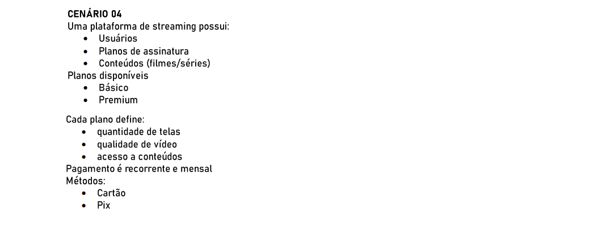

# POO II

### 🚩 Orientação de Desenvolvimento da Atividade

### 🚩 Cenário 04

## 💻 Desenvolvimento da Atividade

<h3>Classes</h3>

    1. USUARIO

    2. PLANO
    subclasses: PlanoBasico, PlanoPremium

    3. CONTEUDO
    subclasses: Filme, Serie (Serie tem Episodios/Aulas)

    4. ASSINATURA

    5. PAGAMENTO
    subclasses: PagamentoCartao, PagamentoPix

    6. CATALOGO

<h3>Métodos</h3>

    1. USUARIO
    assinar(plano, pagamento)
    cancelarAssinatura()
    assistir(conteudo, dispositivo)

    2. PLANO
    getQtdTelas()
    getQualidadeVideo()
    permiteAcesso(conteudo): boolean

    3. CONTEUDO
    getGenero()
    getDuracao()
    getRestricoes()

    4. ASSINATURA
    renovar()
    suspender()
    calcularProximoVencimento()

    5. PAGAMENTO
    cobrarRecorrente(assinatura)
    validarDados()

<h3>Interfaces</h3>

        IPagamento
        cobrar(valor): Comprovante
        agendarCobrancaRecorrente()

        IControleAcesso
        verificarPermissao(usuario, conteudo, plano): boolean

<h3>Relacionamentos</h3>

        Usuario 1..1 Assinatura
        Assinatura referencia Plano e Usuario
        Plano define regras que afetam Conteudo
        Conteudo guardado no Catalogo que é consultado por Usuario/Assinatura

<h2>Tratamento de Exceções</h2>

1. Pagamento recorrente: falhas de cobrança tratadas na camada de pagamento (notificação ao usuário, suspensão de conta).

2. Acesso a conteúdo: checar permissões, lançar exceção se excede número de telas ou qualidade não suportada.

3. Dados de assinatura: tratar erros de banco e consistência de assinaturas.

4. Integrações externas (CDN, gateway): capturar erros.
