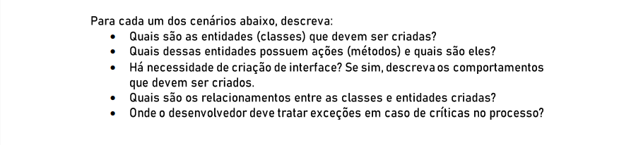
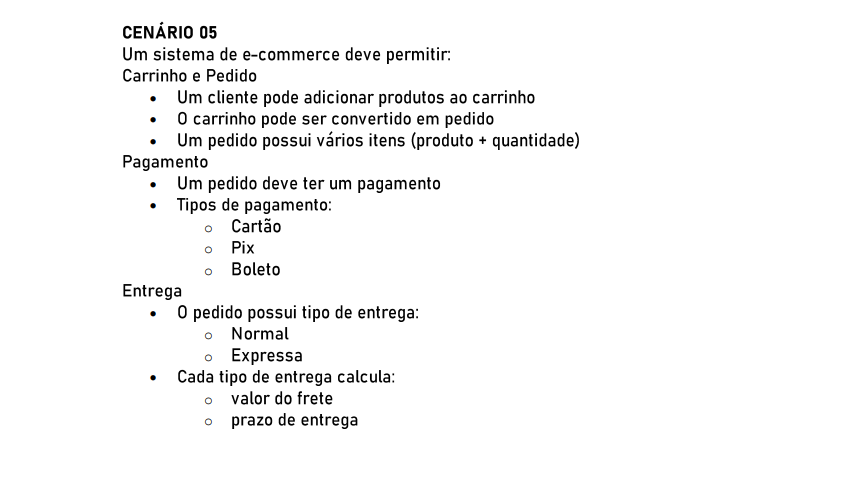

# POO II

### 🚩 Orientação de Desenvolvimento da Atividade

### 🚩 Cenário 05

## 💻 Desenvolvimento da Atividade

<h3>Classes</h3>

    1. CLIENTE

    2. PRODUTO

    3. CARRINHO

    4. ITEMCARRINHO

    5. PEDIDO

    6. ITEMPEDIDO

    7. PAGAMENTO
    subclasses: PagamentoCartao, PagamentoPix, PagamentoBoleto

    8. ENTREGA
    subclasses: EntregaNormal, EntregaExpressa

    9.FRETE

<h3>Métodos</h3>

    1. CLIENTE
    adicionarAoCarrinho(produto, quantidade)
    criarPedido(carrinho, formaPagamento, tipoEntrega) -> Pedido

    2. CARRINHO
    adicionarItem(produto, qtd)
    removerItem(produto)
    calcularTotal()

    3. PEDIDO
    confirmar()
    cancelar()
    adicionarPagamento(pagamento)
    calcularTotalComFrete()

    4. PAGAMENTO
    pagar(valor)
    validar()

    5. ENTREGA
    calcularFrete(endereco, peso, dimensoes): valor
    estimarPrazo(endereco): dias

    6.FRETE
    calcularFrete(tipoEntrega, parametros)

<h3>Interfaces</h3>

        IPagamento
        cobrar(valor): Comprovante

        IEntrega
        calcularFrete(...): decimal
        estimarPrazo(...): int

<h3>Relacionamentos</h3>

    Cliente 1..1 Carrinho
    Carrinho agregação de ItemCarrinho (1..*)
    Pedido composto por ItemPedido (1..*)
    Pedido possui Pagamento e Entrega
    Frete é utilizada pelo Pedido ao confirmar

<h2>Tratamento de Exceções</h2>

1. Adição ao carrinho: verificar estoque e lançar erro de disponibilidade na camada de serviço.

2. Conversão Carrinho->Pedido: validar integridade (preços atualizados, estoque) com transação e rollback se falhar.

3. Pagamento: tratar falhas (autorização, timeout) na camada de pagamento; manter status do pedido consistente (pending, paid, failed).

4. Entrega: erros ao calcular frete ou integrar com transportadora com tratamento e fallback ou notificação e possível bloqueio da finalização.

5. Persistência: usar transações para garantir consistência entre pedido, pagamento e atualização de estoque.
