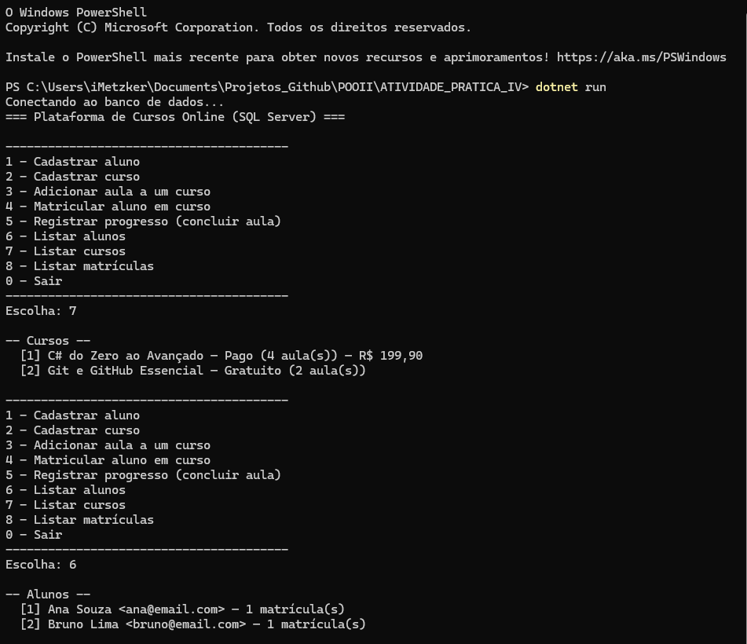
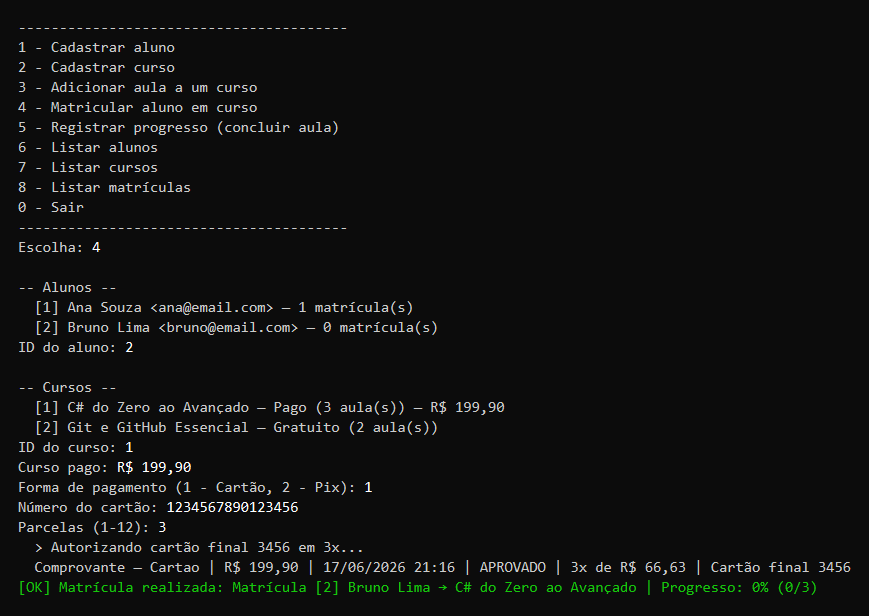
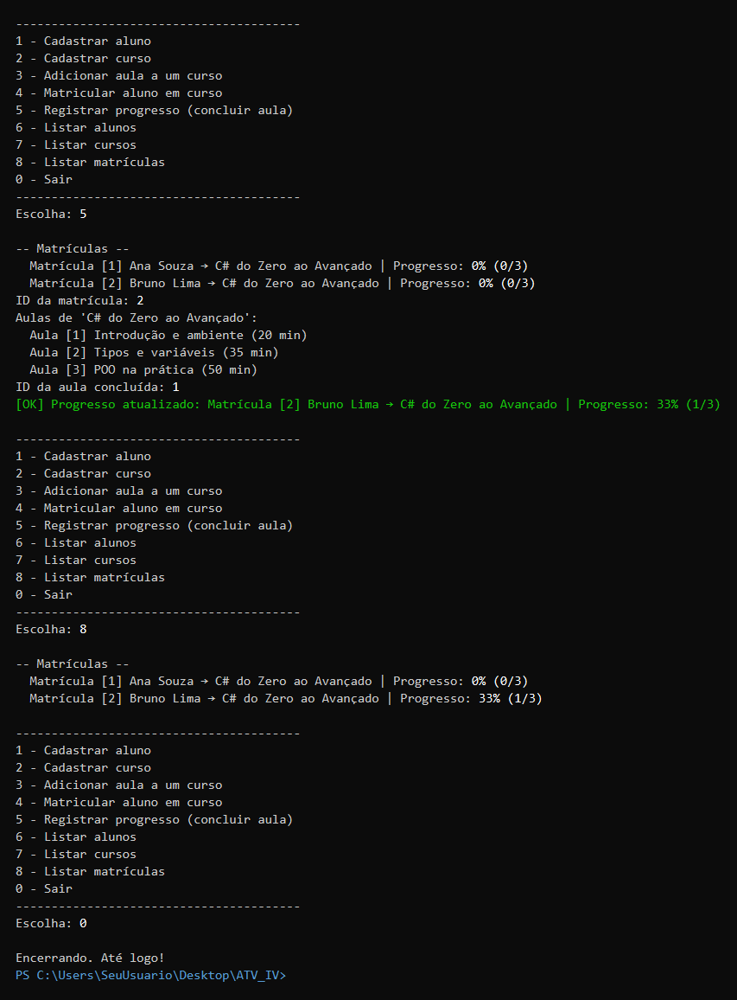

# Atividade Final

> <b>Curso:</b> Sistemas de Informação<br>
> <b>Disciplina:</b> Programação Orientada a Objetos II<br>
> <b>Docente:</b> Maria Laura<br> 
> <b>Cenário:</b> Plataforma de Cursos Online (Cenário 01) <br>
> <b>Integrantes:</b> Ivny X. Metzker e Marcos Vinicius Magalhães


## 🚩 Descrição

- **Aluno** — pode ter várias matrículas.
- **Curso** (abstrato) — possui várias aulas; pode ser **Gratuito** ou **Pago**.
- **Aula** — pertence a um curso.
- **Matrícula** — liga aluno↔curso, registra progresso e pagamento.
- **ProgressoAula** — registra cada aula concluída por matrícula.
- **Pagamento** (abstrato) — `Cartão` ou `Pix`, exigido para cursos pagos.

## 🚩 Tecnologias Utilizadas

- C#
- SQL Server LocalDB
- Entity Framework Core

## 🚨 Pré-requisitos

Antes de rodar, a máquina precisa ter **dois** programas instalados:

1. **.NET SDK 8.0 (LTS) ou superior** — para compilar e executar o projeto.
   - Este projeto tem como alvo o `net8.0` (versão **LTS**, de suporte de longo
     prazo), mas está configurado para rodar também em versões mais novas
     (9, 10, ...) — então qualquer .NET 8 **ou superior** serve.
   - Para conferir se já está instalado, abra o terminal e digite:
     ```powershell
     dotnet --version
     ```
     Deve aparecer um número de versão (ex.: `8.0.404`, `9.0.100`, `10.0.200`...).

2. **SQL Server LocalDB** — é o banco de dados onde tudo é gravado.
   - **Já vem junto com o Visual Studio** (nas cargas de trabalho ".NET" /
     "Desenvolvimento para desktop com .NET").
   - Para conferir, digite no terminal:
     ```powershell
     sqllocaldb info
     ```
     Deve aparecer `MSSQLLocalDB`.

## 🚀 Passo a passo para rodar (terminal)

### Passo 1 — Colocar o projeto na máquina

Clone o repositório do projeto. 

### Passo 2 — Abrir o terminal **dentro** da pasta do projeto

Há duas formas simples:

- **Pelo Explorador de Arquivos:** abra a pasta `ATIVIDADE_PRATICA_IV`, clique na barra de
  endereço no topo, apague o caminho, digite `powershell` e pressione **Enter**.
  Abre um terminal já na pasta certa.
- **Ou** abra o PowerShell e navegue até a pasta com o comando `cd`
  (troque pelo caminho real onde você extraiu):
  ```powershell
  cd C:\Users\SeuUsuario\Desktop\ATIVIDADE_PRATICA_IV
  ```


### Passo 3 — Conferir os pré-requisitos 

```powershell
dotnet --version
sqllocaldb info
```

- Se o `dotnet --version` mostrar uma versão (8.x ou superior) e o
  `sqllocaldb info` mostrar `MSSQLLocalDB`, pode seguir para o Passo 4.
- Se o `sqllocaldb info` não listar `MSSQLLocalDB`, crie e inicie a instância:
  ```powershell
  sqllocaldb create MSSQLLocalDB
  sqllocaldb start MSSQLLocalDB
  ```

### Passo 4 — Executar o projeto

```powershell
dotnet run
```

A primeira execução pode demorar alguns segundos. O programa vai:

1. Conectar no SQL Server LocalDB;
2. Criar o banco `PlataformaCursosDb` e todas as tabelas automaticamente;
4. Mostrar o menu abaixo no console:

```
=== Plataforma de Cursos Online (SQL Server) ===
----------------------------------------
1 - Cadastrar aluno
2 - Cadastrar curso
3 - Adicionar aula a um curso
4 - Matricular aluno em curso
5 - Registrar progresso (concluir aula)
6 - Listar alunos
7 - Listar cursos
8 - Listar matrículas
0 - Sair
----------------------------------------
Escolha:
```

### Passo 5 — Usar o programa

Digite o **número** da opção desejada e pressione **Enter**. Exemplo de uso:

1. Digite `7` e Enter → lista os cursos (cada um com seu **ID**).
2. Digite `6` e Enter → lista os alunos (cada um com seu **ID**).
3. Digite `4` e Enter → matricular: o programa pede o **ID do aluno** e o
   **ID do curso**. Se o curso for **pago**, ele pede a forma de pagamento
   (1 = Cartão, 2 = Pix) e os respectivos dados.
4. Digite `5` e Enter → registrar progresso: informe o **ID da matrícula** e o
   **ID da aula** concluída.
5. Digite `0` e Enter → sair.

## Criar o banco pelo script SQL

Se quiser criar/visualizar o banco manualmente no **SQL Server Management Studio
(SSMS)**, em vez de deixar o programa criar sozinho:

1. Abra o arquivo [script.sql](script.sql) no SSMS.
2. Pressione **F5** (Executar).
3. Ele cria o banco `PlataformaCursosDb`, as tabelas, os índices e os dados de
   exemplo. Depois, rode o programa normalmente (`dotnet run`) — ele usará esse
   banco já existente.

## 🐛 Possíveis bugs

| Erro | Causa | Solução |
|------|-------|---------|
| `error: 52 - Unable to locate a Local Database Runtime installation` | LocalDB não instalado | Instale o LocalDB (ver Pré-requisitos / Passo 3) |
| `O termo 'dotnet' não é reconhecido` | .NET SDK não instalado ou fora do PATH | Instale o .NET SDK 8.0 e **reabra** o terminal |
| `O termo 'sqllocaldb' não é reconhecido` | LocalDB não instalado | Instale o componente "SQL Server Express LocalDB" |
| `framework 'Microsoft.NETCore.App', version '8.0.0' was not found` | Nenhum runtime do .NET 8 ou superior instalado | Instale o **.NET SDK 8.0** (ou mais novo) |

## Connection string

Definida em [Data/PlataformaContext.cs](Data/PlataformaContext.cs):
`Server=(localdb)\MSSQLLocalDB;Database=PlataformaCursosDb;...`

Pode ser sobrescrita pela variável de ambiente `CURSOS_CONNSTRING` , por exemplo,
para usar o **SQL Server Express**:

```
Server=.\SQLEXPRESS;Database=PlataformaCursosDb;Trusted_Connection=True;TrustServerCertificate=True;
```

## 🏦 Estrutura

```
Enums/                  FormaPagamento
Interfaces/             IPagamento
Models/                 Aluno, Aula, Curso, CursoGratuito, CursoPago, Matricula, ProgressoAula
Pagamentos/             Pagamento, PagamentoCartao, PagamentoPix
Data/                   PlataformaContext (DbContext)
Services/               Plataforma (fachada de acesso a dados)
Program.cs              Menu interativo (ponto de entrada)
PlataformaCursos.csproj Configuração do projeto e pacotes (EF Core)
script.sql              Script SQL para criar o banco/tabelas no SSMS
README.md               Este arquivo
```

## 💻  Demonstração

Demonstração do funcionamento do programa
(via `dotnet run`).

**1. Inicialização, menu e listagens (opções `7` e `6`)** o programa conecta
ao banco, exibe o menu e lista os cursos e alunos já cadastrados (cada um com
seu **ID**).



**2. Matrícula em curso pago com pagamento (opção `4`)** ao matricular o aluno
em um curso pago, o programa solicita a forma de pagamento, processa a transação
(polimorfismo de `Pagamento`) e gera o comprovante.



**3. Registro de progresso e listagem final (opções `5`, `8` e `0`)**  connclusão
de uma aula atualiza o progresso da matrícula (0% -> 33%), confirmado na listagem
de matrículas antes de encerrar.


