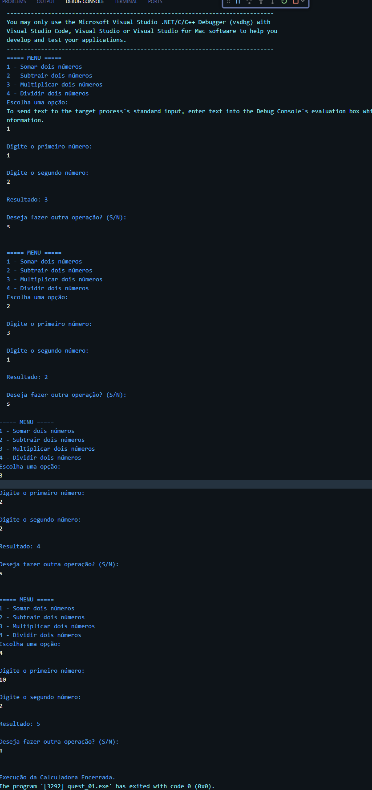
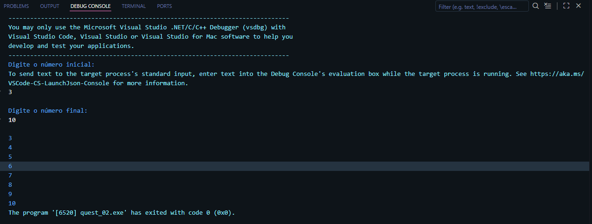
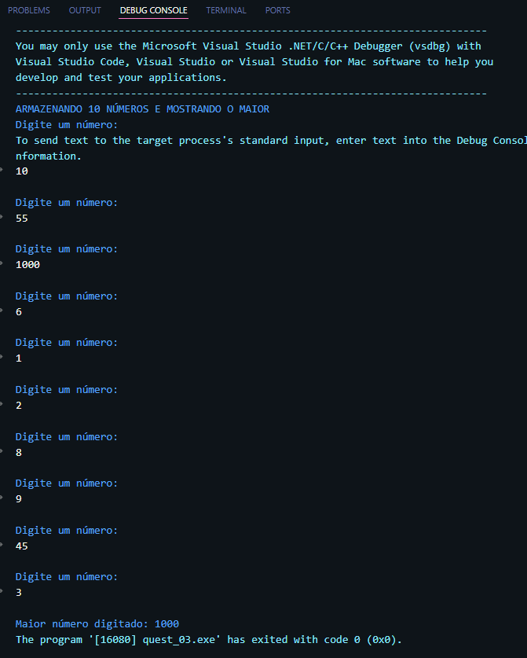
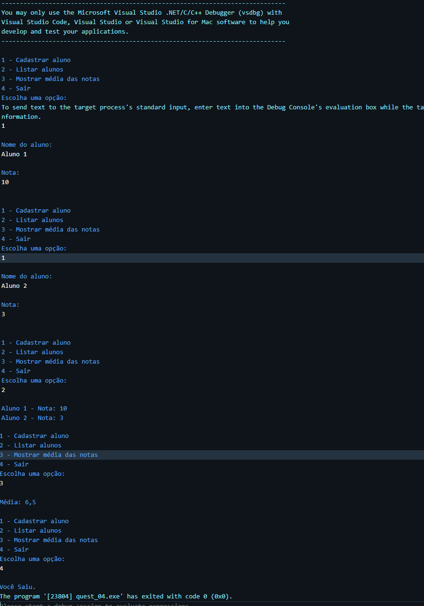

# POO II

 

## 🚀 Atividade Diagnóstica
Repositório temporário destinado a atividades avaliativas da disciplina de Programação Orientada a Objetos II.

> Curso: Sistemas de Informação  
> Período: 7º  
> Docente: Maria Lauara

## 🖥️ Questões Compiladas
Códigos em execução.

### ✨Questão 01

### ✨Questão 02

### ✨Questão 03

### ✨Questão 04

